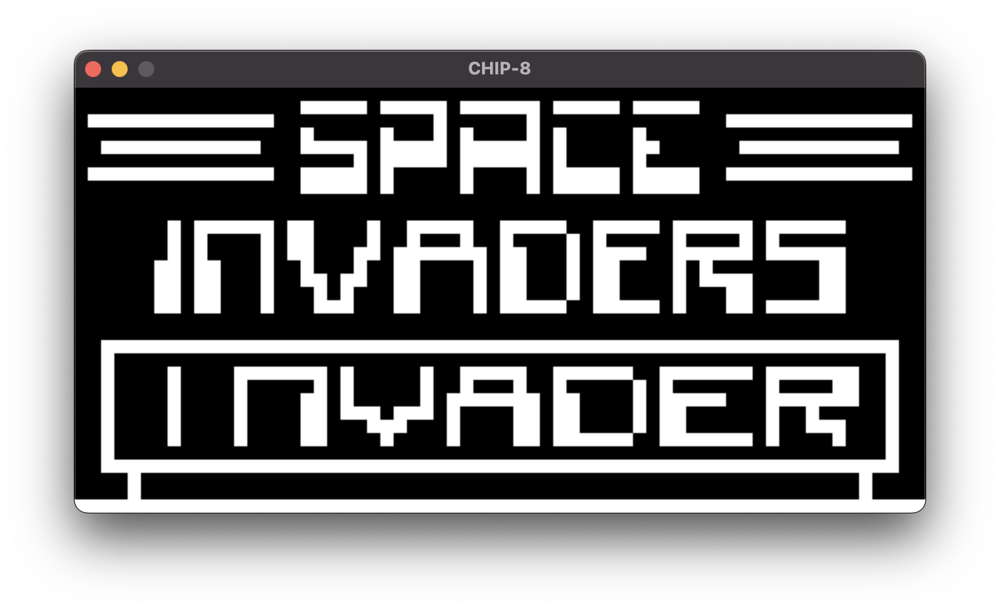

# CHIP-8
My CHIP-8 interpreter/emulator written in C!
  
Below are examples of the interpreter in action.

Top Left: Maze 
 

Top Right: Space Invaders

Bottom Left: Breakout

Bottom Right: Sierpinski Triangle

  
  
  
  

